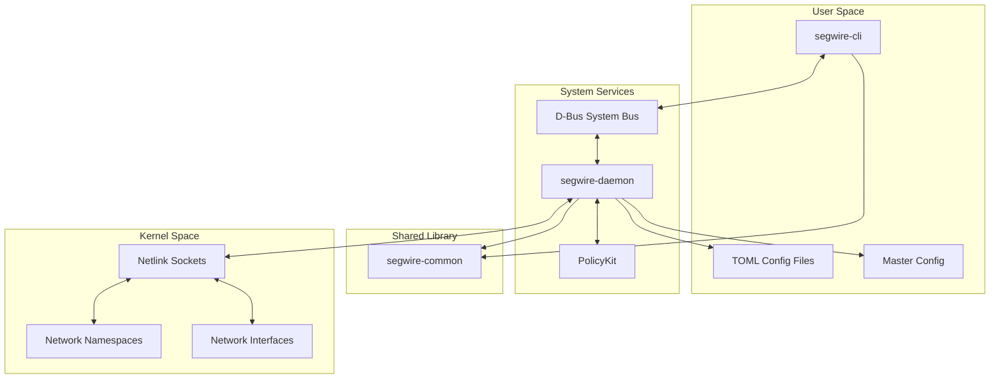

# Design Document

## Overview

The segwire namespace management system consists of three main components:

1. **segwire-daemon** - A system daemon that manages Linux network namespaces based on TOML configuration files
2. **segwire-cli** - A command-line interface that communicates with the daemon via D-Bus
3. **segwire-common** - A shared library crate containing D-Bus types, configuration structures, and common utilities

The system follows a declarative configuration approach similar to systemd-networkd, where administrators define desired namespace states in TOML files, and the daemon ensures the actual system state matches the declared configuration.

### Key Design Principles

- **Declarative Configuration**: Administrators describe desired state, daemon ensures actual state matches
- **Performance & Correctness**: Uses `monoio` and `io_uring` for high-performance configuration and D-Bus monitoring, but explicitly relies on synchronous execution for `nix` namespace syscalls to guarantee strict thread context isolation.
- **Robust Error Handling**: Failure isolation to a single namespace and comprehensive logging
- **Standard Integration**: Uses D-Bus for IPC and PolicyKit for authorization
- **File-Based Configuration**: TOML files for human-readable, version-controllable configuration
- **Configuration-Driven Lifecycle**: Namespace creation and deletion is controlled entirely through configuration file presence - no direct CLI commands for namespace lifecycle management

## Architecture

### High-Level Architecture



### Component Interaction Flow

1. **Startup**: Daemon reads master config, scans for namespace configs
2. **Configuration Processing**: Daemon parses TOML files and validates syntax
3. **Namespace Management**: Daemon creates/updates/deletes namespaces via netlink
4. **CLI Communication**: CLI sends D-Bus method calls to daemon
5. **Authorization**: PolicyKit validates user permissions for operations
6. **Monitoring**: Daemon watches config files for changes using io_uring-based file monitoring

## Components and Interfaces

### segwire-daemon

#### Core Modules

**Configuration Manager**
- Responsible for reading and parsing TOML configuration files
- Monitors configuration directory for changes using io_uring-based file watching
- Validates configuration syntax and semantic correctness
- Manages master configuration and namespace prefix resolution

**Namespace Manager**
- Creates, configures, and destroys Linux network namespaces
- Moves network interfaces between namespaces
- Configures routing tables and DNS resolution within namespaces
- Maintains state tracking for managed namespaces

**D-Bus Service**
- Implements D-Bus interface for CLI communication
- Handles method calls for namespace operations
- Emits signals for status updates and progress notifications
- Integrates with PolicyKit for authorization

**Event Loop**
- Uses monoio runtime with io_uring for high-performance async I/O operations
- Coordinates between configuration monitoring, namespace management, and D-Bus service
- Handles graceful shutdown and cleanup
- Manages concurrent operations and error recovery with io_uring-based file monitoring

#### Key Dependencies (Rust Crates)

```toml
[dependencies]
# D-Bus communication
zbus = "3.0"
zvariant = "3.0"

# Network namespace management
netlink-packet-route = "0.17"
nix = "0.27"

# Configuration parsing
toml = "0.8"
serde = { version = "1.0", features = ["derive"] }

# File system monitoring with io_uring
monoio = { version = "0.2", features = ["sync", "macros"] }

# Logging
tracing = "0.1"
tracing-subscriber = "0.3"

# Error handling
anyhow = "1.0"
thiserror = "1.0"

# Shared library
segwire-common = { path = "../segwire-common" }
```

### segwire-cli

#### Core Modules

**Command Parser**
- Parses command-line arguments and subcommands
- Validates input parameters and provides help text
- Supports commands: status, list, reload, restart, validate

**D-Bus Client**
- Connects to daemon's D-Bus service
- Sends method calls and receives responses
- Handles D-Bus errors and connection failures
- Supports introspection for service discovery

**Output Formatter**
- Formats daemon responses for human-readable output
- Supports different output formats (table, JSON)
- Handles progress updates and real-time status display

#### Key Dependencies (Rust Crates)

```toml
[dependencies]
# D-Bus communication
zbus = "3.0"

# Command-line interface
clap = { version = "4.0", features = ["derive"] }

# Output formatting
tabled = "0.14"
serde_json = "1.0"

# Async runtime using io_uring
monoio = { version = "0.2", features = ["macros"] }

# Error handling
anyhow = "1.0"

# Shared library
segwire-common = { path = "../segwire-common" }
```

### segwire-common

#### Core Modules

**D-Bus Types**
- Defines all D-Bus interface structures and method signatures
- Provides serialization/deserialization for D-Bus communication
- Contains error types for D-Bus operations
- Implements D-Bus introspection data

**Configuration Types**
- Shared configuration structures for TOML parsing
- Validation logic for configuration files
- Environment variable substitution utilities
- Configuration schema definitions

**Common Utilities**
- Shared error types and error handling utilities
- Logging configuration and utilities
- Network interface validation functions
- Namespace name validation and prefix handling

#### Key Dependencies (Rust Crates)

```toml
[dependencies]
# D-Bus communication types
zbus = "3.0"
zvariant = { version = "3.0", features = ["serde"] }

# Configuration parsing
toml = "0.8"
serde = { version = "1.0", features = ["derive"] }

# Error handling
anyhow = "1.0"
thiserror = "1.0"

# Validation
regex = "1.0"
```

## Data Models

### Configuration Structures

#### Master Configuration (`/etc/segwire/daemon.toml`)

```toml
[daemon]
# Namespace prefix for this daemon instance
namespace_prefix = "segwire"

# Configuration directory to monitor
config_dir = "/etc/segwire/namespaces"

# Cleanup policy on shutdown
cleanup_on_shutdown = true

# Logging configuration
log_level = "info"

[dbus]
# D-Bus service name
service_name = "org.segwire.NamespaceManager"

# D-Bus object path
object_path = "/org/segwire/NamespaceManager"
```

#### Namespace Configuration (`/etc/segwire/namespaces/*.toml`)

```toml
[namespace]
# Namespace name (will be prefixed with daemon prefix)
name = "isolated-app"

# Description for documentation
description = "Isolated network environment for application"

[interfaces]
# Network interfaces to move into namespace
move = ["eth1", "wlan0"]

# Virtual interfaces to create
[[interfaces.virtual]]
name = "veth-app"
type = "veth"
peer = "veth-host"

[routing]
# Default gateway within namespace
default_gateway = "192.168.100.1"

# Static routes
[[routing.routes]]
destination = "10.0.0.0/8"
gateway = "192.168.100.1"
metric = 100

[dns]
# DNS servers for namespace
servers = ["8.8.8.8", "8.8.4.4"]

# Search domains
search = ["example.com"]

[environment]
# Environment variables for substitution
APP_NETWORK = "192.168.100.0/24"
```

### D-Bus Interface Definition

The D-Bus interface is defined in the `segwire-common` crate and shared between daemon and CLI:

```xml
<!DOCTYPE node PUBLIC "-//freedesktop//DTD D-BUS Object Introspection 1.0//EN"
"http://www.freedesktop.org/standards/dbus/1.0/introspect.dtd">
<node>
  <interface name="org.segwire.NamespaceManager">
    <!-- Methods -->
    <method name="ListNamespaces">
      <arg direction="out" name="namespaces" type="a(ssss)"/>
    </method>
    
    <method name="GetNamespaceStatus">
      <arg direction="in" name="name" type="s"/>
      <arg direction="out" name="status" type="(sssas)"/>
    </method>
    
    <method name="RestartNamespace">
      <arg direction="in" name="name" type="s"/>
      <arg direction="out" name="success" type="b"/>
    </method>
    
    <method name="ReloadConfiguration">
      <arg direction="out" name="success" type="b"/>
    </method>
    
    <method name="ValidateConfiguration">
      <arg direction="in" name="config_path" type="s"/>
      <arg direction="out" name="valid" type="b"/>
      <arg direction="out" name="errors" type="as"/>
    </method>
    
    <!-- Signals -->
    <signal name="NamespaceCreated">
      <arg name="name" type="s"/>
    </signal>
    
    <signal name="NamespaceDeleted">
      <arg name="name" type="s"/>
    </signal>
    
    <signal name="ConfigurationReloaded">
      <arg name="count" type="u"/>
    </signal>
    
    <signal name="OperationProgress">
      <arg name="operation" type="s"/>
      <arg name="progress" type="d"/>
      <arg name="message" type="s"/>
    </signal>
  </interface>
</node>
```

### Internal Data Structures

These structures are defined in `segwire-common` and shared between components:

#### Namespace State

```rust
#[derive(Debug, Clone, Serialize, Deserialize)]
pub struct NamespaceState {
    pub name: String,
    pub full_name: String, // prefixed name
    pub status: NamespaceStatus,
    pub config_path: PathBuf,
    pub interfaces: Vec<InterfaceInfo>,
    pub routes: Vec<RouteInfo>,
    pub dns_config: DnsConfig,
    pub created_at: SystemTime,
    pub last_updated: SystemTime,
}

#[derive(Debug, Clone, Serialize, Deserialize)]
pub enum NamespaceStatus {
    Creating,
    Active,
    Failed(String),
    Deleting,
}
```

## Error Handling

### Error Categories

1. **Configuration Errors**
   - Invalid TOML syntax
   - Missing required fields
   - Invalid network interface names
   - Conflicting routing rules

2. **System Errors**
   - Insufficient privileges (CAP_SYS_ADMIN)
   - Network interface not found
   - Namespace creation failure
   - Netlink communication errors

3. **D-Bus Errors**
   - Service registration failure
   - Method call timeout
   - Authorization denied
   - Connection lost

4. **File System Errors**
   - Configuration file not readable
   - Directory monitoring failure
   - Permission denied

### Error Handling Strategy

The error types are defined in `segwire-common` and used by both daemon and CLI:

```rust
#[derive(Debug, thiserror::Error)]
pub enum SegwireError {
    #[error("Configuration error: {0}")]
    Config(#[from] ConfigError),
    
    #[error("Network operation failed: {0}")]
    Network(#[from] NetworkError),
    
    #[error("D-Bus error: {0}")]
    DBus(#[from] zbus::Error),
    
    #[error("Permission denied: {0}")]
    Permission(String),
    
    #[error("System error: {0}")]
    System(#[from] nix::Error),
}

impl SegwireError {
    pub fn is_recoverable(&self) -> bool {
        match self {
            SegwireError::Config(_) => true,
            SegwireError::Network(_) => true,
            SegwireError::Permission(_) => false,
            SegwireError::System(_) => false,
            SegwireError::DBus(_) => true,
        }
    }
}
```

## Testing Strategy

### Unit Testing

**Configuration Manager Tests**
- TOML parsing with valid and invalid configurations
- Environment variable substitution
- Configuration validation logic
- File watching and change detection

**Namespace Manager Tests**
- Mock netlink operations for namespace creation
- Interface movement simulation
- Route configuration testing
- DNS configuration validation

**D-Bus Service Tests**
- Method call handling with mock clients
- Signal emission verification
- Error response formatting
- Authorization integration testing

### Integration Testing

**End-to-End Workflow Tests**
- Complete daemon startup and configuration loading
- CLI command execution against running daemon
- Configuration file changes and automatic updates
- Graceful shutdown and cleanup

**System Integration Tests**
- Real network namespace creation (requires privileges)
- Actual network interface manipulation
- D-Bus system bus integration
- PolicyKit authorization testing

### Test Environment Setup

```rust
// Test utilities for mocking system operations
pub mod test_utils {
    use std::sync::{Arc, Mutex};
    
    pub struct MockNetlinkSocket {
        operations: Arc<Mutex<Vec<NetlinkOperation>>>,
    }
    
    impl MockNetlinkSocket {
        pub fn new() -> Self {
            Self {
                operations: Arc::new(Mutex::new(Vec::new())),
            }
        }
        
        pub fn get_operations(&self) -> Vec<NetlinkOperation> {
            self.operations.lock().unwrap().clone()
        }
    }
}
```

### Performance Testing

**Scalability Tests**
- Concurrent CLI operations
- Configuration file change burst handling
- Memory usage under load

**Latency Tests**
- CLI command response times
- Configuration change detection latency
- D-Bus method call overhead
- Namespace creation/deletion timing

## Security Considerations

### Privilege Management

The daemon requires `CAP_SYS_ADMIN` capability for namespace operations. This is handled through:

1. **Systemd Service Configuration**
   ```ini
   [Unit]
   Description=Segwire Network Namespace Manager
   
   [Service]
   Type=notify
   ExecStart=/usr/bin/segwire-daemon
   CapabilityBoundingSet=CAP_SYS_ADMIN
   AmbientCapabilities=CAP_SYS_ADMIN
   NoNewPrivileges=true
   ```

2. **Runtime Privilege Checking**
   ```rust
   fn check_capabilities() -> Result<(), SegwireError> {
       use nix::unistd::Uid;
       
       if !Uid::effective().is_root() {
           return Err(SegwireError::Permission(
               "Daemon requires CAP_SYS_ADMIN capability".to_string()
           ));
       }
       Ok(())
   }
   ```

### PolicyKit Integration

PolicyKit rules for fine-grained authorization:

```xml
<?xml version="1.0" encoding="UTF-8"?>
<!DOCTYPE policyconfig PUBLIC
 "-//freedesktop//DTD PolicyKit Policy Configuration 1.0//EN"
 "http://www.freedesktop.org/standards/PolicyKit/1/policyconfig.dtd">
<policyconfig>
  <action id="org.segwire.namespace.restart">
    <description>Restart network namespace</description>
    <message>Authentication is required to restart network namespaces</message>
    <defaults>
      <allow_any>auth_admin</allow_any>
      <allow_inactive>auth_admin</allow_inactive>
      <allow_active>auth_admin_keep</allow_active>
    </defaults>
  </action>
  
  <action id="org.segwire.namespace.status">
    <description>View namespace status</description>
    <message>Authentication is required to view namespace status</message>
    <defaults>
      <allow_any>yes</allow_any>
      <allow_inactive>yes</allow_inactive>
      <allow_active>yes</allow_active>
    </defaults>
  </action>
</policyconfig>
```

### Configuration File Security

- Configuration files must be owned by root with 644 permissions
- Directory traversal protection in configuration paths
- Input validation for all configuration values
- Sanitization of environment variable substitution

## Deployment and Installation

### Package Structure

```
/usr/bin/segwire-daemon          # Main daemon executable
/usr/bin/segwire-cli             # CLI tool
/usr/lib/libsegwire_common.so    # Shared library (if needed for dynamic linking)
/etc/segwire/daemon.toml         # Master configuration
/etc/segwire/namespaces/         # Namespace configurations directory
/usr/lib/systemd/system/segwire-daemon.service  # Systemd service
/usr/share/polkit-1/actions/org.segwire.policy  # PolicyKit rules
/usr/share/dbus-1/system-services/org.segwire.NamespaceManager.service  # D-Bus service
```

### Systemd Integration

```ini
[Unit]
Description=Segwire Network Namespace Manager
Documentation=man:segwire-daemon(8)
Wants=network.target
After=network.target

[Service]
Type=notify
ExecStart=/usr/bin/segwire-daemon
ExecReload=/bin/kill -HUP $MAINPID
Restart=on-failure
RestartSec=5

# Security settings
NoNewPrivileges=true
ProtectSystem=strict
ProtectHome=true
ReadWritePaths=/etc/segwire
CapabilityBoundingSet=CAP_SYS_ADMIN
AmbientCapabilities=CAP_SYS_ADMIN

[Install]
WantedBy=multi-user.target
```

### Installation Script

```bash
#!/bin/bash
# Install segwire namespace management system

# Create configuration directories
mkdir -p /etc/segwire/namespaces

# Install binaries
install -m 755 segwire-daemon /usr/bin/
install -m 755 segwire-cli /usr/bin/

# Install configuration files
install -m 644 daemon.toml /etc/segwire/

# Install systemd service
install -m 644 segwire-daemon.service /usr/lib/systemd/system/

# Install PolicyKit rules
install -m 644 org.segwire.policy /usr/share/polkit-1/actions/

# Install D-Bus service file
install -m 644 org.segwire.NamespaceManager.service /usr/share/dbus-1/system-services/

# Reload systemd and enable service
systemctl daemon-reload
systemctl enable segwire-daemon
```