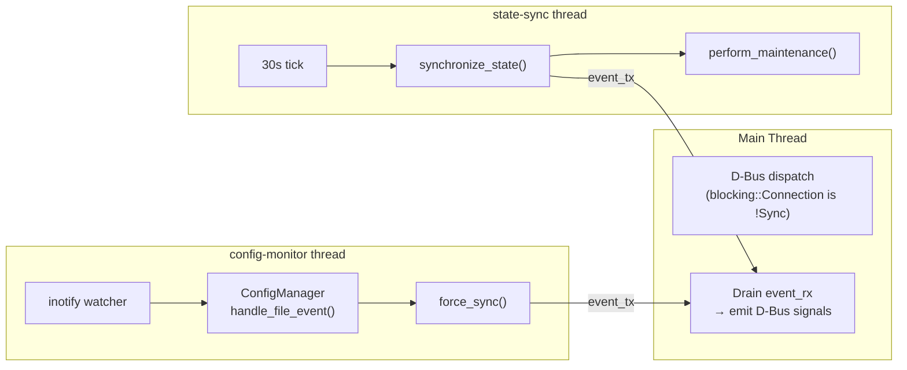
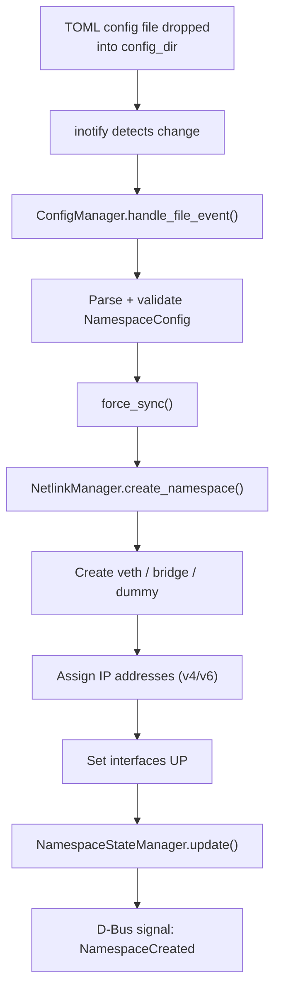
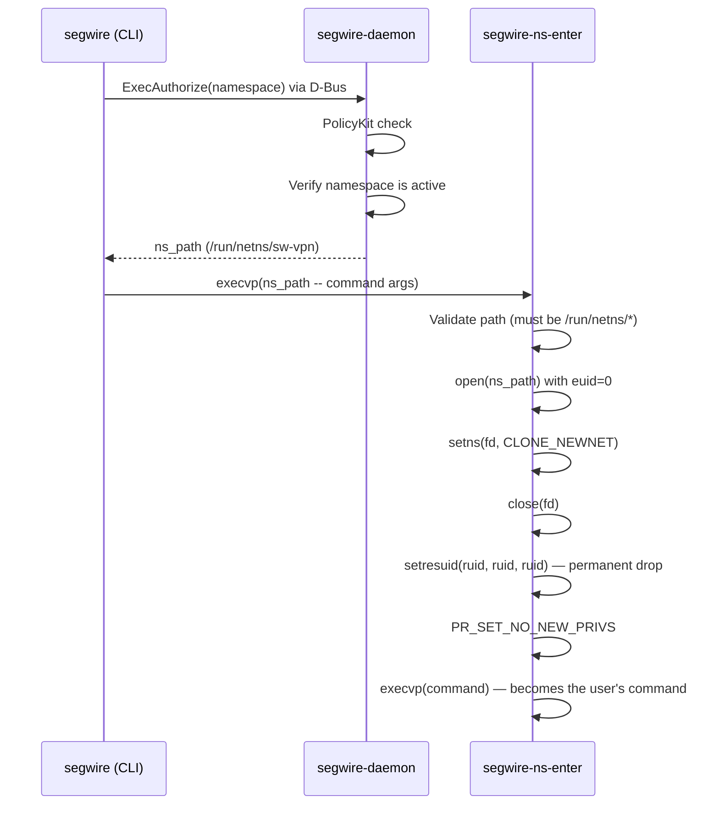

# Architecture

## Crate Overview

Segwire is a Rust workspace with five crates, each at a distinct privilege level:

| Crate | Binary | Runs as | Purpose |
|---|---|---|---|
| `segwire-daemon` | `segwire-daemon` | root (systemd) | Namespace lifecycle, netlink, D-Bus server, inotify config monitoring |
| `segwire-cli` | `segwire` | unprivileged user | D-Bus client, clap-based CLI |
| `segwire-common` | _(library)_ | — | Shared types: config parsing, validation, error types, D-Bus interface constants, logging |
| `segwire-ns-enter` | `segwire-ns-enter` | setuid root → drops to user | Enters a network namespace and execs a command |
| `segwire-test` | _(test only)_ | — | Integration test harness with private D-Bus sessions |

## Event Loop

The daemon's main loop (`event_loop.rs`) coordinates three concerns on separate threads:

**Lock ordering**: When acquiring multiple locks, always lock `config_manager` before `state_manager`. Never hold `state_manager` while acquiring `config_manager`.

**Shutdown**: A `SIGINT`/`SIGTERM` handler sets an `AtomicBool`. All threads poll it and exit gracefully. The main thread optionally cleans up namespaces (returns interfaces, deletes netns) based on `cleanup_on_shutdown` config.

## D-Bus Interface

Service name: `org.segwire.NamespaceManager`
Object path: `/org/segwire/NamespaceManager`
Interface: `org.segwire.NamespaceManager`

### Methods

| Method | Parameters | Returns | PolicyKit action |
|---|---|---|---|
| `ListNamespaces` | — | `Vec<(name, status, config_path, description)>` | `namespace.status` |
| `GetNamespaceStatus` | `name` | `(name, full_name, status, config_path, created_at, last_updated)` | `namespace.status` |
| `GetDaemonStatus` | — | `(version, uptime, managed_count, active_count)` | `namespace.status` |
| `DeleteNamespace` | `name` | `(success, message, details)` | `namespace.delete` |
| `ReloadConfiguration` | — | `(success, message, details)` | `namespace.manage` |
| `ValidateConfiguration` | `config_path` | `(valid, errors, warnings)` | `namespace.status` |
| `RestartNamespace` | `name` | `(success, message, details)` | `namespace.delete` |
| `ExecAuthorize` | `namespace` | `ns_path` | `namespace.exec` |

### Signals

| Signal | Parameters | Emitted when |
|---|---|---|
| `NamespaceCreated` | `name, config_path` | A namespace is created |
| `NamespaceDeleted` | `name, reason` | A namespace is deleted |
| `NamespaceStatusChanged` | `name, old_status, new_status` | Status transitions |
| `OperationProgress` | `operation, progress, message` | Long-running operations |

## Namespace Lifecycle

**Namespace naming**: All namespaces are prefixed with the daemon's `namespace_prefix`. Config name `vpn` with prefix `sw` becomes `sw-vpn`. The netns bind-mount lives at `/run/netns/sw-vpn`.

## Exec Flow

The `segwire exec` command allows unprivileged users to run commands inside namespaces. The flow involves all three binaries:

The setuid helper's elevated privileges last **microseconds** — just long enough to open the namespace file and call `setns()`. See [Security.md](../Security.md) for the full security model.

## Netlink Operations

The daemon uses raw netlink sockets (via `netlink-packet-route` and `netlink-packet-core`) for all network operations:

- Create / delete network namespaces (bind-mount under `/run/netns/`)
- Create virtual interfaces (veth, bridge, dummy, macvlan, ipvlan)
- Move interfaces between namespaces
- Assign IPv4 and IPv6 addresses
- Set interface link state (UP/DOWN)
- Query interface information

No external `ip` commands are used — all operations go through the kernel netlink API directly.
